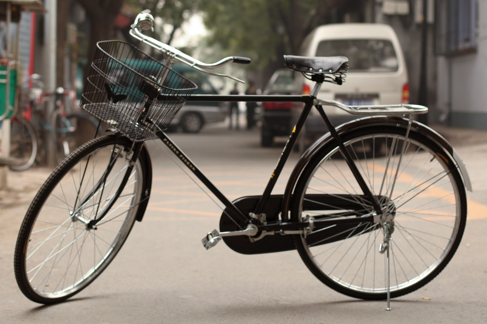
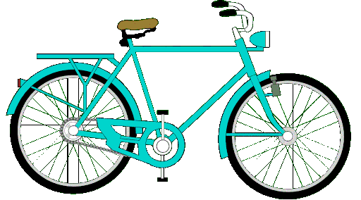

# Introduction to bikes

Bikes are a convenient, affordable and environment-friendly means of transportation. Plus, they're really fun to ride! Read this guide to get the basics of what a bike is, how it works, and how to get it rolling.

## What is a bike?

A bike (short for **bicycle**) is a vehicle used for transporting one person (multiple-person versions also exist) and relatively small baggage. It usually has two wheels, one behind the other, and is human-powered. 

!!! note
    Bikes are extremely popular and have been around since the 19th century, and consequently come in a near-infinite number of variants. From traditional pedal-powered models to electric bikes, from single-person to 52-person tandems, from the simplest city two-wheelers to the weirdest experimental pedal-powered contraptions, bikes offer a wide range of options to suit specific preferences.

A bike is a simple yet robust invention built around a steel (or aluminium) frame. It is lightweight (10-15 kg on average) as compared to other means of transportation and uses a few simple mechanisms that are easy to fix in case of a failure. This means that in many cases you can mend your bicycle all by yourself. 

There are several basic types of bikes, each designed for different purposes and terrain. The most common ones are the following:

- **Road bikes**: Designed for speed and efficiency on paved roads, with lightweight frames and narrow tires.

- **Mountain bikes**: Built for off-road trails and rugged terrain, featuring suspension systems, knobby tires, and durable frames.

- **City bikes**: Designed for everyday city commuting, with features like fenders, racks, and lights for practicality and visibility.

- **Cruiser bikes**: Comfortable, upright bikes with wide handlebars, large padded seats, and balloon tires, ideal for casual riding on flat terrain.

- **Electric bikes (e-bikes)**: Bicycles with integrated electric motors to assist with pedaling, providing extra power for longer distances or uphill climbs.

## How it works

Bikes are propelled by converting leg power to wheel rotation. As the rider pushes down on the pedals, the cranks attached to the bottom bracket rotate. This motion is transferred to the chain, which wraps around a chainring connected to the front crankset. The chain then engages with a rear gear cassette or sprocket attached to the rear wheel. As the chain moves along the gear cassette, it causes the rear wheel to rotate, pushing the bike forward. With each pedal stroke the process is repeated, allowing the rider to maintain speed and momentum.

## Quick start: How to get it rolling

!!! warning "Caution"
    You ride a bike seated and with your feet above the ground, which resembles horse riding to some extent. Maintaining balance while riding is key, so it's crucial to choose a relatively safe open area for practising, as there is risk of falling or crashing into objects! 

Start by sitting on the seat, placing your hands on the handlebars in front of you, and your feet on the ground. Push off with one foot to get moving forward, and then lift your other foot onto the pedal and start pushing it down. Use both feet to pedal while looking straight ahead. Use the handlebars to steer and lean slightly in the direction you want to go. To stop, gently squeeze the levers located on the handlebars with both hands. Apply the brakes evenly and come to a gradual halt. Place one foot or both feet on the ground to maintain balance. Enjoy your ride!

!!! note
    At first, finding your balance when getting off may be a bit challenging, but don't loose heart. You will get better with each attempt. If you're worried about injuries, you can get special protective gear at a local bike store.  

