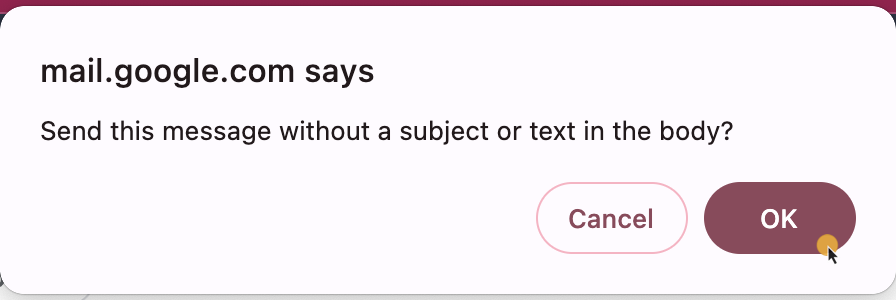

# Sending a file via Gmail

Attaching files to emails in Gmail is a free and easy way to share your content with others. Follow this short instruction to learn how to do it.

!!! note
    In Gmail, you can send files of up to 25 MB in attachments. This can be a single file of this size or multiple files that add up to this limit.

## Prerequisites

- A Gmail account. If you don't have it, start [here](https://support.google.com/mail/answer/56256?hl=en).

## Create a new message and send your file

0. Log in to your Gmail account.
0. From the sidebar, select **Compose**.
    
0. In the **New Message** window, click on the **Recipients** field and add the email addresses of the persons you want to send the file to. 
    

    !!! note 
        In case of multiple recipients, separate the addresses with a comma or semicolon.

0. Optionally, in the **Subject** field, provide the subject for your email.
0. In the message toolbar, click on the paper clip icon.
    
0. In the file selector box that appears, find and select your file, then click **Open**.
0. After a while, the file is attached. If you're ready to go, click **Send**. 
    
0. In case you didn't add a subject and text in the message, Gmail will prompt you to confirm. Click **OK**, or **Cancel** to add message text.
    
That's it! You've just shared your content with the wider world.